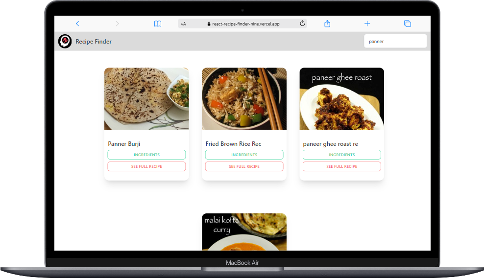
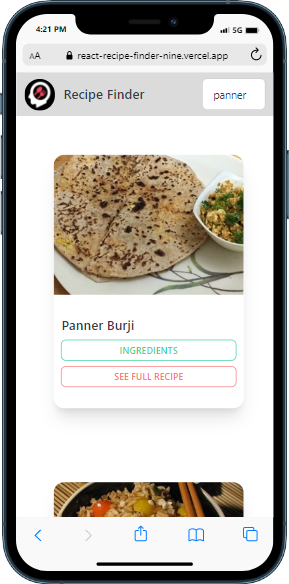

# Recipe Finder

This is Basic Recipe finder web app. In  this you can search the recipe and see the ingredients required for making that recipe.I have use react js, Tailwind CSS, Daisy UI, Edemam recipe finder api, axios

## Table of contents

- [Overview](#overview)
  - [Screenshot](#screenshot)
  - [Links](#links)
- [My process](#my-process)
  - [Built with](#built-with)
  - [What I learned](#what-i-learned)

## Overview

### Screenshot

### Links

- GitHub Repo URL: [Recipe Finder](https://github.com/faisgit/react-recipe-finder)
- Live URL: [Recipe Finder](https://react-recipe-finder-nine.vercel.app/)

## My process

### Built with

- Semantic HTML5 markup
- CSS custom properties
- Flexbox
- CSS Grid
- Mobile-first workflow
- [React](https://react.dev/) - JS library
- [Tailwind CSS](https://tailwindcss.com/) - CSS Framework
- [Daisy ui](https://daisyui.com/) - Tailwind Css Component Library
- [Axios](https://www.npmjs.com/package/axios) - It's use for fetching Api
- [Edemam](https://www.edamam.com/) -  A Recipe Finder Api

### What I learned

From this, Project i learn How to use React Js and how to use ustate hook, fetch data from api,axios. I also learn how to use Tailwind CSS in any Project with Daisy UI
